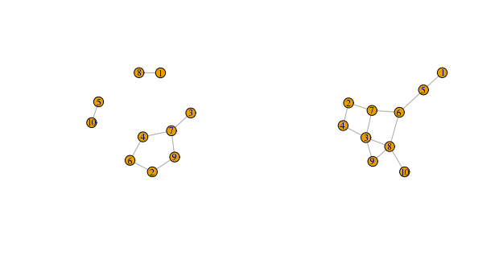
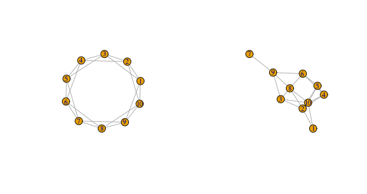

---
header-includes:
- \usepackage{amssymb,amsthm,amsmath}
- \usepackage{chemarr}
output: pdf_document
---

<!--
You can delete the header-includes (lines 3-5 above) if you like and also the chunk below since it is loaded in the skeleton.Rmd file.  They are included so that chap2.Rmd will compile by itself when you hit Knit PDF.
-->

```{r include_acstats_2, include = FALSE}
# This chunk ensures that the acstats package is installed and loaded
# This acstats package includes the template files for the thesis and also
# two functions used for labeling and referencing
if(!require(devtools))
  install.packages("devtools", repos = "http://cran.rstudio.com")

if(!require(acstats)){
  library(devtools)
  devtools::install_github("Amherst-Statistics/acstats")
  }
library(acstats)
```

```{r setupch2, include=FALSE}
library(sand)
library(igraph)
library(network)
library(sna)
library(statnet)
library(ergm)
library(xtable)

options(xtable.comment = FALSE)
```

# Graph Models

A *graph model* takes in fixed parameters that generate a graph that can vary in structure with each iteration. Equivalently, it is also possible to consider a model for a graph as a collection, or *ensemble*,   

$$\{\mathbb{P}_{\theta}(G), G \in \mathcal{G}: \theta \in \Theta\}$$

in which $G$ is a collection or ensemble of possible graphs, $P_\theta$ is a probability distribution on $G$, and $\theta$ is a vector of parameters, ranging over possible parameters in $\Theta$.

Many of the explanations and derivations for the Erdős-Rényi and Watts-Strogatz networks here follow from @newman_networks:_2010. The section about exponential random graph models (ERGMs) follow largely from @butts_introduction_2015.


At the time of this writing, we are still working on further explanations of the properties of the Erdős-Rényi and Watts-Strogatz models. This will be included as part of the Mathematics thesis.


## Erdős-Rényi 

The Erdős-Rényi (also known as the Erdős-Rényi-Gilbert) model is one of the most studied of the graph models. It is also one of the simplest, as it takes only two parameters. The model $G(N_V, N_E)$, first suggested by @gilbert1959random, takes in $N_V$, the number of nodes, and $N_E$ the number of edges. Erdős and Rényi (1959, 1960, 1964) considered the model of the form $G(N_V, p)$, where instead of using the number of edges, the probability of an edge forming between any pairs of nodes is fixed. Our focus is on the latter model. 

```{r erdosrenyiexample, fig.align = 'center', eval=TRUE, include = FALSE}
set.seed(499)

g1.er <- erdos.renyi.game(n = 10, p = 0.25)
g2.er <- erdos.renyi.game(n = 10, p = 0.25)
```

```{r erdosrenyiexampleplot, eval=FALSE, echo=FALSE}
par(mfrow=c(1,2))
plot(g1.er, vertex.size=20, vertex.label.cex = 0.75)
plot(g2.er, vertex.size=20, vertex.label.cex = 0.75)
```



In the $G(N_V, p)$ model, graphs constructed according to this model could potentially look every different from each other. This goes back to the idea that a graph model can be thought of as a probability distribution over an ensemble of networks, and all networks in this particular ensemble have equal probability of being chosen. We immediately see a drawback in graphs generated from this model: it places no significance on structures that we may see in our observed graph--such as dense clusters or cliques. 

To use this model in our simulation study, we simply take the number of nodes and the probability of a link forming equal to the number of observed edges divided by the number of possible edges (the number of nodes choose 2). That is, $\frac{N_{E}} {{N_{V} \choose 2}}$.


## Watts-Strogatz

@watts_collective_1998 noticed that many networks have high levels of clustering and only require short average path lengths between mode nodes. In the Erdős-Rényi model, simulated graphs of parable magnitude tend to have smaller-than-expected clustering coefficients. In the Watts-Strogatz model, we start with $N_V$ vertices arranged in a circular fashion, $r$ number of beginning neighbors for each node, and the probability $p$ of an edge being moved to another pair of vertices.  

```{r wattsstrogatzexample, eval = TRUE, echo = FALSE}
set.seed(499)

g1.ws <- watts.strogatz.game(dim = 1, size = 10, nei = 2, p = 0)
g2.ws <- watts.strogatz.game(dim = 1, size = 10, nei = 2, p = 0.25)
```

```{r wattsstrogatzexampleplot, eval=FALSE, echo=FALSE}
par(mfrow=c(1,2))
plot(g1.ws, vertex.size=20, vertex.label.cex = 0.75)
plot(g2.ws, vertex.size=20, vertex.label.cex = 0.75)
```

In a regular lattice with 10 nodes, each having two neighbors, the clustering coefficient is relatively high at exactly $0.5$. Diameter and average path length are nontrivial, and can be rather high as well (at $3$ and $1.667$, respectively). 



By adding a probability of rewiring, the clustering coefficient increases, while diameter and average path length changes, but not necessarily in predictable ways. This makes sense because this rewiring essentially creates random shortcuts in the network framework. In the right-hand graph of Figure 3.2, which is the left-hand graph after a rewiring probability of $0.25$, we see that the transitivity, diameter, and average path length are now $0.507$, $4$, and $1.733$, respectively. 
 
While it is entirely possible that a network could potentially have such a kind of rewiring process, it is less likely that this is true in the context of social networks. In other words, ties between people do not usually disappear and randomly reappear between others. However, we can still make use of the fact that it starts with a connected lattice structure with some number of neighbors and randomly add edges until we get a graph of similar order and size. In the case where we start with a lattice of $r = 1$ neighbor, however, this is almost no different from the Erdős-Rényi model. This is because a lattice structure with only one neighbor is very similar to a random assignment of edges (but with the restiction that each node only has a degree of $1$). Additionally, depending on the number of edges that need to be added to the network, the starting lattice may not have a large effect on the overall structure of the graph generated. 

## Exponential Random Graph Models (ERGMs)

Exponential random graph models (ERGMs) are a class of models that can also be used to generate probability distributions for a set of random graphs. ERGMs have enormous flexibility in construction since it allows any combinition of parameters from a given data set to be used in constructing the model. We are not only able to simulate additional graphs from the underlying probability distribution like in the Erdős-Rényi and Watts-Strogatz models, but we are also able to obtain maximum-likelihood estimates of the model for the data set, conduct goodness-of-fit tests for 

The general form for an ERGM is as follows: 

$$P(Y = y) = \frac {exp(\theta'g(y))} {k(\theta)}$$

where $Y$ is the random variable for the state of the network and realization y, $g(y)$ is the vector of model statistics for the network $y$, $\theta$ is the vector of coefficients for those statistics, and $k(\theta)$ is the quantity in the numerator summed over all possible networks. 


At the time of this writing, we are still working on the explanation of properties of ERGMs. This will be included as part of the Mathematics thesis. 


### Deriving Erdős-Rényi-Gilbert from ERGMs

The Erdős-Rényi-Gilbert and Watts-Strogatz models are actually special cases of ERGMs. Here, we will show that the Erdős-Rényi model can be derived from an ERGM that only takes into acount the number of edges in a graph. 


At the time of this writing, we are also still working on this derivation. It will be included as part of the Mathematics thesis. 

