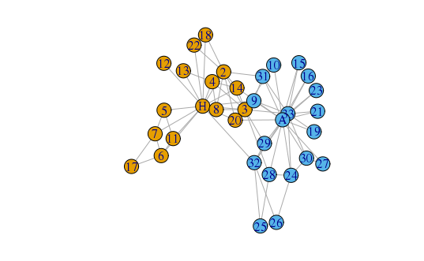
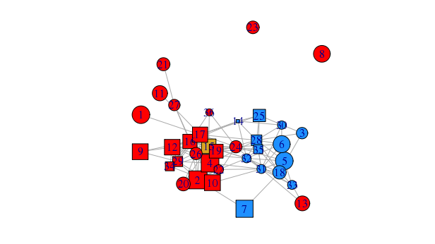

<!-- The {.unnumbered} option here means that the introduction will be "Chapter 0." -->

```{r setupch0, include=FALSE}

library(sand)
library(igraph)
library(network)
library(sna)
library(statnet)
library(ergm)
library(xtable)

options(xtable.comment = FALSE)
```

# Introduction {.unnumbered} 

Generally speaking, a *network* is a collection of inter-related things. This broad definition allows networks to be used in a variety of disciplines. Here, we focus on *social networks*, in which the elements are either individuals or groups (though they need not be human), called *actors* and the relationships among them are called *ties*. These ties can be friendships, collaborations, email exchanges, and so on. Social networks have been a growing field of study since the 1930s. Even before the computer age, people have observed unique relationships among individuals (Kolaczyk 2009 and Newman 2010). One famous example is Milgram's letter experiments. Here, @travers1967small considered 296 individuals in Nebraska and Massachusetts who were instructed to contruct chains of correspondence by letter until the correspondence reached a target person in Boston. Out of the 64 letter chains that succeeded, they discovered that, overall, these chains did not require that many people. In fact, the median number of people the letters had to go through was about six, giving rise to the popular term "six degrees of separation." This phenomenon is not true for all networks; in fact, many social networks exhibit characteristics not seen in other types of networks. Would it be possible then, for us to model social networks depite phenomena such as the "six degrees of seperation?" Models for networks certainly exisit, but how accurate are they? It turns out that through a simulation study, we can hope to find an answer--or at least a nod in the right direction. However, before heading straight to a simulation study, we must be careful in our approach. Exactly how do we mathematically define a network? What does a model for a network consist of? How would we measure accuracy for such models? We begin with some mathematical background before describing the components of the simulation study and we will see many examples of social networks in subsequent sections.

## Basic Terminology and Definitions [^1] 

[^1]: The terms and definitions listed here is certainly not an exhaustive list. This section follows largely from Kolaczyk's *Statistical Analysis of Network Data*. Please see @kolaczyk_statistical_2009 for more details. 

While a network is collection of vertices and edges, more formally, we borrow much of the mathematical terminology for networks and network statistics from graph theory. We define a network as a *graph*, which is an object denoted $G = (V, E)$ such that $E$ is the set of edges and $V$ is the set of vertices. Each edge connects two vertices, and so for any two vertices $i, j \in V$, if $i$ and $j$ have a connection then the ordered pair $\{i, j\} = e \in E$. In this case, we say $i$ is *adjacent* to $j$ and that $i$ and $j$ are *neighbors*. A vertex is *incident* on an edge if that vertex is the endpoint of that edge. For example, a vertex $i$ would be incident on $e = \{i, j\}$ if j does not connect with any other vertex in V. Here, we make no distinction in the ordering of vertices. That is, $\{i, j\}$ is the same as $\{j, i\}$. Such a graph is called *undirected* (or *non-directed*).

The *order* of a graph G is defined to be the number of vertices in $G$, denoted $N_V = |V|$. Similarly, the *size* of $G$ is the number of edges in $G$, denoted $N_E = |E|$.

Graphs that have ordering to their edges, that is, $\{i, j\} \in E$ is different from $\{j, i\} \in E$, are called *directed graphs* (or *digraphs*), and the edges in a directed graph are called *directed edges* (or *arcs*). 

We can also represent a network with just the connections that are present (or not present) between nodes by using an adjacency matrix. Given a graph $G = (V, E)$, the adjacency matrix $\textbf{A}$ is an $N_V$ x $N_V$ matrix in which: 

\[ A_{ij} = \begin{cases}
    1 & \text{if } \{i, j\} \in E \\
    0 & \text{otherwise.} 
  \end{cases}
\]
    
It is also possible to assign edge weights to individual elements of the adjacency matrix; for example, assigning an edge weight $w_e$ to $e = \{i, j\} \in E$. Matrix $\textbf{A}$ is symmetric if $G$ is a undirected graph, but this may not necessarily be the case if $G$ is a directed graph. This is because $\{i, j\} \in E$ does not necessarily guarantee that $\{j, i\} \in E$ for directed graphs. 
    
While the adjacency matrix $\textbf{A}$ is a data structure that fully characterizes a graph, size and reading time on the part of the computer can become an issue very quickly, especially in the context of working with data structures and algorithms. For a graph with $N$ vertices, it's corresponding adjacency matrix will have $N^2$ elements. Thus, we can also consider an alternative: an *edge list* is a two-column list of all the edges and their corresponding vertices present in a graph. More often than not, a graph will not have an edge between every pair of nodes, so it is more often the case that using an edge list will mean we are dealing with strictly less than $N^2$ elements. Larger networks, as we will soon see, are more often than not represented with with an edge list.  

To describe how to move about in a network, we define a *walk* in graph $G$ to be a sequence that begins and ends with two vertices and alternates between vertices and edges. The sequence $(a_0, e_1, a_1, e_2, ..., v_{l-1}, e_l, v_l)$ denotes one path from vertex $a_0$ to vertex  $a_l$, where for all $e_i \in E$, $e_i$ connects points $a_{i-1}$ and $a_i \in V$. Using this notation, we define the *length* of the walk to be the value $l$.  More refined than a walk, a *trail* is defined to be a walk in which the sequence does not traverse through the same edge more than once. And even more refined still is a *path* in which a walk does not travel through the same vertex twice. 

A *circuit* is a trail in which the starting and ending vertices is the same. A *cycle* is a walk with length of at least three that starts and ends at the same vertex but all other vertices are unique. An acyclic graph contains no cycles. The length of the shortest path(s) between any two vertices is defined to be the *distance* (or *geodesic distance*). This distance is infinite if no path between two particular vertices exist. The *diameter* is the longest (geodesic) distance achieved in a graph. In a digraph, a *directed walk* is analogous to a walk, but uses arcs to get from one node to another. 

A vertex $j$ is *reachable* from another vertex $i$ is there is a walk from $i$ to $j$. G is *connected* if all vertices in $G$ are is reachable by some other vertex in $G$. 

A *component* is a subgraph that is maximally connected. A *clique* is a graph or subgraph that is complete. A graph is *regular* if each vertex has the same *degree*. That is, each vertex has the same number of edges connecting to it. Degree is usually denoted $k$, and a particular vertex with a degree $k$ is called a *$k$-star*. A graph is *complete* if every vertex is has an edge with all other vertices in the graph. An undirected graph is *simple* if it has no *loops* and *multi-edges*, meaning vertices do not have an edge that points to itself and any pair of vertices do not have more than one edge between them. Edges on a simple graph are called *proper edges*.

Connectedness and simpleness are actually very important characteristics of networks as many of the descriptive statistics that we will see can only be applied graphs with such properties. In fact, our focus here will be limited to simple and connected graphs. 

A graph can contain other information or data, called *attributes*, beyond just the collection of nodes and links. Incorporating these attributes, otherwise known as *decorating* a graph, can occur in both the nodes, links and even the entire graph itself. Both edge and vertex attributes can be discrete or continuous. An example of a discrete attribute is a binary case of positive or negative relationship between pairs of vertices. An example of continuous would then be the strength (i.e. weight) of the relationship between pairs. A *weighted graph* is a graph whose edges include weights (that are nonzero and between 0 an 1)

```{r exampledatach0, eval=TRUE, echo=FALSE}
data(karate)
data(lazega)
```

## Example 1: Zachary's Karate Club

One famous (or infamous) social network, called "the karate club of Zachary," is observed by anthropologist @zachskarateclub. Nodes indicate the 34 individual members of the karate club while the links indicate the 78 social ties among pairs of the members. Figure 1 provides what is called a "visual summary" of the karate network data. As shown by the colors of the nodes, the club, at this particular moment in time, is being divided into two clusters centering around two nodes as labeled by letters (the master and disciple of the dojo).

```{r karateplot, message = FALSE, eval = FALSE, echo = FALSE}
plot(karate)
```


It is possible to display more than just the actors and their relationships. As the network shows, we can provide more information by assigning other visual cues--such as node shapes to determine gender, node size to indicate belt rank, and edge weights to determine the strength of the social tie--to each member. 

## Example 2: Lazega's Law Firm 

Consider a network of lawyers that reflects the relational data collected by @lazega1999multiplexity from a New England law firm consisting of over 70 lawyers to study cooperation in organizations. This network has 36 lawyers and 115 collaborations. In Figure 2, each lawyer is individually labeled with smaller numbers indicating seniority. Shapes for each lawyer indicate the type of practice: litigation (circles) and corporate (squares). The shapes' sizes indicate the relative number of years of having been in with the law firm. Color is used to indicate office location (red, blue, and yellow). Edges indicate collaboration between partners. The graph below provides a visual summary of the lawyer network data.

```{r lawyerplot, message = FALSE, eval = FALSE,  echo = FALSE}
# Office location indicated by color.
colbar <- c("red", "dodgerblue", "goldenrod")
v.colors <- colbar[V(lazega)$Office]
# Type of practice indicated by vertex shape.
v.shapes <- c("circle", "square")[V(lazega)$Practice]
# Vertex size proportional to years with firm.
v.size <- 3.5*sqrt(V(lazega)$Years)
# Label vertices according to seniority.
v.label <- V(lazega)$Seniority
# Reproducible layout.
set.seed(42)
l <- layout.fruchterman.reingold(lazega)
plot(lazega, layout=l, vertex.color=v.colors,
     vertex.shape=v.shapes, vertex.size=v.size,
     vertex.label=v.label)
```
 

We can also continue adding layers of data to this visual as well. For example, if the appropriate data was recorded, it is possible quantify and/or qualify the collaborations between the lawyers. We can apply weights to give an idea of how frequently any pair of lawyers interacted with each other in this resource exchange; we can even apply line types (solid, dashed, double-dashed, etc.) to indicate how this collaboration took place: was it done in person, through the phone, through email, or some combination of the three? 

## Modeling Real-World Networks

As hinted earlier, one topic of study that has been gaining ground is using models to "model" observed networks. They are more formally known as *graph models* and for now, we can think of them ways to simulate graphs. Which models can generate graphs that are visually and structurally similar to a networks that we observed? In reality, there are many graphs to choose from, and with a network chosen, we can answer this question through a simulation study. This means that we would generate graphs from different graph models and compare *descriptive network statistics* between the simulated graphs and the observed graphs to see how accurate these graph models are. 

Being able to model observed networks would benefit many fields. By accurately predicting how networks form, it may be possible to understand how friendships among people form or even how pieces of information spread across people. More generally, we can improve traffic flow, provide better product suggestions to online shoppers, and help prevent the spread of diseases.

In this work, we will provide a general overview about network statistics and graph models, followed by a simulation study that tests different graph models and see how well they "fit" a target network of our choosing. In Chapter 1, we will focus on various network statistics. These statistics have direct (but sometimes non-trivial) analogs to the measures of spread and central tendency. In Chapter 2, we focus on describing various graph models, such as the Erdős-Rényi and Watts-Strogatz models and several different exponential random graph models (ERGMs). These graph models will be used to fit a network of our choosing. Here, we will be using an undirected, simple, and connected component of the Facebook network consisting of $4039$ nodes and $88234$ edges. Chapter 3 describes our simulation study and results. We compare the network statistics of our simulated graphs to those of the observed data set. We close with our Conclusion (Chapter 4), which describes some of the limitations in this study and potential future work. 