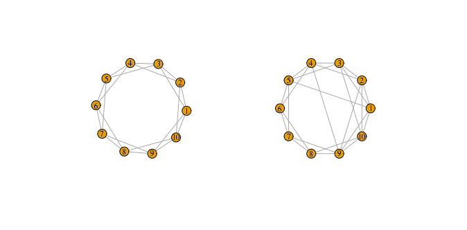

---
header-includes:
- \usepackage{amssymb,amsthm,amsmath}
- \usepackage{chemarr}
output: pdf_document
---

<!--
You can delete the header-includes (lines 3-5 above) if you like and also the chunk below since it is loaded in the skeleton.Rmd file.  They are included so that chap2.Rmd will compile by itself when you hit Knit PDF.
-->

```{r include_acstats_2, include = FALSE}
# This chunk ensures that the acstats package is installed and loaded
# This acstats package includes the template files for the thesis and also
# two functions used for labeling and referencing
if(!require(devtools))
  install.packages("devtools", repos = "http://cran.rstudio.com")

if(!require(acstats)){
  library(devtools)
  devtools::install_github("Amherst-Statistics/acstats")
  }
library(acstats)
```

```{r setupch2, include=FALSE}
library(sand)
library(igraph)
library(network)
library(sna)
library(statnet)
library(ergm)
library(xtable)

options(xtable.comment = FALSE)
```

# Graph Models

A *graph model* takes in fixed parameters that generate a graph that can vary in structure with each iteration. Equivalently, it is also possible to consider a model for a graph as a collection, or *ensemble*,   

$$\{\mathbb{P}_{\theta}(G), G \in \mathcal{G}: \theta \in \Theta\}$$

in which $G$ is a collection or ensemble of possible graphs, $P_\theta$ is a *probability distribution* on $G$ (that is, a function that assigns a value for very possible graph that G can be, whose total sums to $1$), and $\theta$ is a vector of parameters that describe the graphs that G can be, ranging over possible parameters in $\Theta$ (Kolaczyk 2009, Newman 2010). [^3] 

[^3]: Many of the explanations and derivations for the Erdős-Rényi and Watts-Strogatz networks here follow from @newman_networks:_2010. Much of the explanation about exponential random graph models (ERGMs) follows largely from @butts_introduction_2015, @hunter_ergm:_2008, and @jacksonergms2013. 

## Erdős-Rényi Model

The *Erdős-Rényi model* (also known as the *Erdős-Rényi-Gilbert model*) is one of the most studied graph models.[^2] It is also one of the simplest, as it takes only two parameters. The model $G(N_V, N_E)$, first suggested by @gilbert1959random, takes in $N_V$, the number of nodes, and $N_E$ the number of edges. Erdős and Rényi (1959, 1960, 1964) considered the model of the form $G(N_{V}, p)$, where instead of using the number of edges, the probability of an edge forming between any pairs of nodes is fixed. Our focus is on the latter model. It is clear that, on average, the $G(N_{V}, p)$ model would comprise of many more networks than the $G(N_V, N_E)$ model, as the number edges is not fixed. This allows us to consider a larger number of networks with similar network statistics seen in Chapter 1. However, while unlikely, it is possible to obtain a graph with no edges or all possible edges from the  $G(N_{V}, p)$ model (Newman 2010). 

[^2]: Many other names for this model exist, such as *Bernoulli model* (or *Bernoulli random graph*) and the *Poisson random graph* due to the properties of its degree distribution, as we will see. In fact, Paul Erdős and Alfréd Rényi were not the first to study or discover this model. According to Newman (2010), the earliest known study of this model is by Ray Solomonoff and Anatol Rapoport in 1951. 

```{r erdosrenyiexample, fig.align = 'center', eval=TRUE, include = FALSE}
set.seed(499)

g1.er <- erdos.renyi.game(n = 10, p = 0.25)
g2.er <- erdos.renyi.game(n = 10, p = 0.25)
```

```{r erdosrenyiexampleplot, eval=FALSE, echo=FALSE}
par(mfrow=c(1,2))
plot(g1.er, vertex.size=20, vertex.label.cex = 0.75)
plot(g2.er, vertex.size=20, vertex.label.cex = 0.75)
```


In the $G(N_{V}, p)$ model, graphs constructed according to this model could potentially look every different from each other. This goes back to the idea that a graph model can be thought of as a probability distribution over an ensemble of networks, and all networks in this particular ensemble have equal probability of being chosen. We immediately see a potential drawback in graphs generated from this model: it places no significance on structures that we may see in our observed social networks--such as having high clustering, cliques, and connected components. However, because of the random placement of the edges across the vertices, values such as average path length are often quite small, even for large graphs (Newman 2010). This is one of many things that characterize social networks and is a primary the motivation for using this model for our analysis (even as a starting point).

The Erdős-Rényi model has other nice properties, some of which we discuss below. Even with only two parameters $N_{V}$ and $p$ on hand, we can still create formulas that allow us to calculate various network statistics, such as average degree and clustering coefficient, and describe the model's degree distribution.

As indicated earlier, the $G(N_V, p)$ model is the collection of simple graphs with exactly $N_{V}$ vertices, meaning that a particular simple graph $g$ with exactly $N_V$ vertices has probability 
$$P(G = g) = p^{N_E}(1 - p)^{\left({N_V \choose 2} - N_E \right)}$$
of being picked. For precisely $N_E$ edges, there are ${{N_{V} \choose 2} \choose N_{E}}$ ways to arrange the $N_{E}$ edges among the ${N_V \choose 2}$ possible edges. Thus, the total probability of a random graph $G$ with $N_{E}$ edges and $N_{V}$ vertices is 
$$P(G) = {{N_{V} \choose 2} \choose N_{E}}p^{N_E}(1 - p)^{{N_V \choose 2} - N_E}$$
This, however, is simply a binomial distribution, where we have some probability of success ($p$), two possible outcomes (edge formation or no edge formation), a finite number of trials (${N_{V} \choose 2}$ distinct edges), and ${{N_{V} \choose 2} \choose N_{E}}$ different ways in which the outcomes can be arranged. Using this, the mean value of $N_E$ for the model is then a weighted average. It is the sum of the products of every possible number of edges $N_E$ and the total probability that a graph with $N_{V}$ vertices and $N_{E}$ edges appears, $P(N_{E})$. However, because we know the probability of an edge forming, the mean number of edges would equal to the product of the total number of possible vertices ${N_{V} \choose 2}$ and the probability $p$. This makes sense as we can expect that $100p$ percent of the possible edges in the graph to actually have edges. Thus, the mean number of edges $\langle N_{E} \rangle$ for a random graph $G$ is
$$ \langle N_{E} \rangle = \sum_{N_{E}=0}^{{N_{V} \choose 2}} N_{E}P(N_{E}) = {N_{V} \choose 2}p$$

For a graph with exactly $N_{E}$ edges, it is easy to see that the mean degree is $\frac {2N_{E}} {N_{V}}$. The factor of $2$ allows an edge to be counted as part of the degree for each of the pair vertices that it connects. By taking a similar weighted average, where we sum the products of the average degree of a graph with $N_E$ edges with the total probability of a graph with $N_E$ edges being chosen, we can get the average degree, denoted $c$ or $\langle N_{V} \rangle$, for this model. Using the formula for the mean number of edges above, we can simplify this weighted average as
$$
\begin{aligned}
c &= \langle N_{V} \rangle \\
&= \sum_{N_{E}=0}^{{N_{V} \choose 2}} \frac {2N_{E}} {N_{V}} P(N_{E}) \\
&= \frac {2} {N_{V}} {N_{V} \choose 2}p \\
&= (N_{V} - 1)p
\end{aligned}
$$
The final expression in this equation makes sense; for any vertex on the random graph, we would expect $100p$ percent of the other $N_{V} - 1$ vertices to be connected to it (Newman 2010).

We can also describe the degree distribution of the $G(N_V, p)$ model. We show it is a binomial distribution, and that it actually converges to the Poisson distribution as the number of vertices $N_{V}$ increases infinitely. Observe that the probability, $p_k$, of a vertex connected to $k$ other vertices (without loops) is
$$p_{k} = {N_{V} -1 \choose k}p^{k}(1 - p)^{N_{V} - 1 - k},$$
which is a binomial distribution (Newman 2010). 

Consider the equation for the mean number of edges: $c = (N_{V} - 1)p$. Rewriting this for $p$ gives, $p = \frac {c} {N_{V} - 1}$. This tells us that as the number of nodes increases, the probability $p$ will decrease to $0$ indefinitely. Using, this, we can rewrite the $(1 - p)^{N_{V} - 1 - k}$ factor of the equation for $p_{k}$ above as the solution to the limit as $N_{V} \to \infty$, as shown below. 
$$
\begin{aligned}
(1 - p)^{N_{V} - 1 - k} &= e^{ln((1 - p)^{N_{V} - 1 - k})} \\
&= e^{N_{V} - 1 - k}ln(1 - \frac {c} {N_{V} - 1}) \\
&\simeq e^{-(N_{V} - 1 - k)(\frac {c} {N_{V} - 1})} \\
&\simeq e^{-c},
\end{aligned}
$$
where we have expanded the natural logarithm as a Taylor series. These approximations become more exact as $n \to \infty$ (Newman 2010). 

Similarly, we can take the limit as $n \to \infty$ for the ${N_{V} - 1 \choose k}$ factor of the $p_k$ probability.
$${N_{V} - 1 \choose k} = \frac {(N_{V} - 1)!} {(N_{V} - 1 - k)!k!} = \frac {(N_{V} - 1)^{k}} {k!}.$$

Combining these two equations and $p = \frac {c} {N_{V} - 1}$, the probability $p_{k}$ becomes

$$
\begin{aligned}
p_{k} &= {N_{V} -1 \choose k}p^{k}(1 - p)^{N_{V} - 1 - k} \\
&= \frac {(N_{V} - 1)^{k}} {k!}\left(\frac {c} {N_{V} - 1}\right)^{k}e^{-c} \\
&= e^{-c} \frac{c^{k}} {k!}
\end{aligned}
$$
as $N_{V} \to \infty$. This equation is simply the Poisson distribution (Newman 2010). 

To use this model in our simulation study, we simply take the number of nodes, $N_{V}$, and the probability of a link forming, which equals the number of observed edges divided by the number of possible edges, that is, $\frac{N_{E}} {{N_{V} \choose 2}}$. While we have discussed issues of using the Erdős-Rényi model earlier--such as clustering--the random placement of nodes serves as a good starting point. The idea is to see if we can find a model that does at least better than the random assignment of edges to the vertices. 

## Watts-Strogatz Model

@watts_collective_1998 noticed that many networks in real life have high levels of clustering and only require short average path lengths between nodes with high degree. In the Erdős-Rényi model, simulated graphs of parable magnitude tend to have smaller-than-expected clustering coefficients. As we had seen in Milgram's experiment, networks among people are not quite has disconnected as we had once thought. If any two people in the world are, on average, ever seperated by six people, there is some notion of a "small-world." In the Watts-Strogatz model, we start with several parameters: $N_V$ vertices, which are arranged in a circular fashion, which we will call the "circular model", the number of beginning neighbors for each node, $r$, and the rewiring probability, $p$, of an edge being moved to another pair of vertices.  A variant of this model, which we will use instead, sets the rewiring probability to be zero and utilizes a shortcut probability that added edges randomly to the starting circular model that connect vertices that did not have an edge before (Newman 2010).

```{r wattsstrogatzexample, include = FALSE}
set.seed(499)

g1.ws <- watts.strogatz.game(dim = 1, size = 10, nei = 2, p = 0)

g2.ws <- watts.strogatz.game(dim = 1, size = 10, nei = 2, p = 0)
# the effect of adding one edge to the circular arrangement
randomedgepairs <- sample(1:10, 8, replace=TRUE)
g2.ws <- simplify(add_edges(g2.ws, randomedgepairs))

diameter(g1.ws)
average.path.length(g1.ws)
transitivity(g1.ws, type = "localaverage")
diameter(g2.ws)
average.path.length(g2.ws)
transitivity(g2.ws, type = "localaverage")
```

```{r wattsstrogatzexampleplot, include = FALSE}
par(mfrow=c(1,2))
plot(g1.ws, vertex.size = 20, vertex.label.cex = 0.75)
plot(g2.ws, vertex.size = 20, vertex.label.cex = 0.75, 
     layout=layout_in_circle)
```

In a circular model with $10$ nodes, each having two neighbors, the clustering coefficient is relatively high at exactly $0.5$. Diameter and average path length are nontrivial, and can be rather high as well, at $3$ and $1.667$, respectively. 



By adding edges (instead of simply rewiring), the diameter and average path length tend to decrease. This makes sense because this rewiring creates random shortcuts in the network framework. In the right-hand graph of Figure 3.2, which is the left-hand graph after adding $4$ random edges, we see that the diameter and average path length have decreased to $2$, and $1.467$, respectively.

Like the Erdős-Rényi model, the Watts-Strogatz model also has very nice properties. Not only is it able to achieve a high clustering coefficient due to the inherent circular structure--which was definitely a drawback seen in the previous model--but adding in shortcuts also allow for average path lengths to be small as well. Other properties, such as degree distributions and counts of triangle and triples, and clustering coefficients, are shown below.  

Given a circular model with $N_{V}$ vertices and number of starting neighbors $r$, a triangle on the model is represented by traveling across two edges in the same direction from a starting vertex, followed by one edge back to that vertex. With $r$ neighbors, there are ${\frac {r} {2} \choose 2} = \frac {1} {4} N_{V} r \left(\frac {1} {2} r - 1 \right)$ ways to choose the two starting edges, and then $N_V$ ways to take the last step back, making for a total of $\frac {1} {2} N_{V} r(r - 1)$ triangles. The number of triples for each vertex is ${r \choose 2} = \frac {1} {2}r(r - 1)$ since any two unique edges from a vertex will connect three vertices. This, the total number of triples is ${r \choose 2} = \frac {1} {2}N_{V}r(r - 1)$.

Combining these results, we have the clustering coefficient of the circular model.
$$
\begin{aligned}
C &= \frac {(\text{number of pairs of neighbors of } i \text{ that are connected})} {(\text{number of pairs of neighbors of } i)} \\
&= \frac {\frac {1} {4} N_{V} r \left(\frac {1} {2} r - 1 \right) \times 3} {\frac {1} {2} N_{V} r(r - 1)} \\
&= \frac {3(r - 2)} {4(r - 1)}.
\end{aligned}
$$
There is a minimum clustering coefficient of $0$ if $r = 2$ and a maximum of $\frac {3} {4}$ as $r \to \infty$. Note that this value is also independent of $N_{V}$ (Newman 2010). 

The starting circular model has $\frac {1} {2} N_{V}r$ non-shortcut edges. It is possible to add in shortcut edges to pairs of vertices that have yet to be connected with some probability $p$. Thus, on average, we add approximately $\frac {1} {2} N_{V}rp$ shortcuts--which mean there are $N_{V}rp$ ends created by the shortcuts. The probability $p_{s}$ that a number of shortcuts, $s$, is attached to any one vertex has mean $rp$ follows a Poisson distribution
$$p_{s} = e^{-rp} \frac {(rp)^{s}} {s!}.$$
Using the fact that the total degree of a vertex $k$ is the sum of the starting neighbors $r$ and the number of starting shortcuts $s$, that is $k = r + s$, we can combine this with the equation above to get the degree distribution for the Watts-Strogaz model:

$$p_{k} = e^{-rp}\frac {(rp)^{k - r}} {k - r},$$
for $k \geq r$ and $p_{k} = 0$ if $k < r$ (Newman 2010).

While it can be difficult to precisely calculate the clustering coefficient, we can calculate a limit for the number of triangles and triples. The number of triangles in the circular model remain unchanged, and the number of triangles created by the shortcuts is negligible compared to the number that the circle originally contained for large graphs. This is because the number of paths of length two that are completed by shortcuts to form triangles remains constant for large $N_{V}$. The argument is similar for new triangles formed from two or three shortcuts as well. Thus, the leading term for the number of triangles in the Watts-Strogatz model is $\frac {1} {4} N_{V}r \left(\frac {1} {2} r - 1 \right)$, which is equal to that of the circular model. For the number of triples, we consider the $\frac {1} {2} N_{V} r(r - 1)$ triples from the circular structure itself, the $\frac {1} {2}N_{V}rp$ shortcuts on average for each vertex times $r$ neighbors times $2$ ends for each shortcut equals $N_{V}r^{2}p$ number of triples created by a shortcut combining with an edge in the circle, and the $\frac {1} {2} r^{2} p^2$ expected number of connected triples centered at a vertex times $N_{V}$ vertices equals $\frac {1} {2} N_{V} r^{2} p^2$. Thus, 
$$
\begin{aligned}
C &= \frac {(\text{number of triangles}) \times 3} {\text{number of connected triples}}  \\
&= \frac {\frac {1} {4} N_{V} r \left(\frac {1} {2} r - 1 \right) \times 3} {\frac {1} {2} N_{V} r(r - 1) + N_{V}r^{2}p + \frac {1} {2} N_{V} r^{2} p^2} \\
&= \frac{3(r - 2)} {4(r - 1)+8rp + 4rp^{2}}.
\end{aligned}
$$
When $p = 0$, the clustering coefficient is equal to that of the circular model. And as $p$ increases, the clustering coefficient will decrease. It reaches a minimum value of $C = \frac {3(r - 2)} {(4c - 1)}$ when $p = 1$ (Newman 2010). 

Calculating other parameters, such as average path length, become much more difficult. In fact, no exact expressions for average path length have been discovered; only approximations. One special property of path lengths in this model, however, is that they *scale* with the model parameters. This means that path length is calculated in terms of some function that does not depend on any parameters. For more information on scaling, see @newman_networks:_2010.

While it is entirely possible that a network could potentially have some kind of rewiring process, it is less likely that this is true in the context of social networks. In other words, ties between people do not usually disappear and randomly reappear between others. However, we can still make use of the possibility that a social network can start with a circular model with some initial number of neighbors. New edges to create shortcuts can be added until we get a graph of similar order and size. 

In the case where we start with circular model of $r = 1$ neighbor, however, this is no different from the Erdős-Rényi model. This is because the circular model with only one neighbor is very similar to a random assignment of edges (but with the restriction that each node only has a degree of $1$). Additionally, depending on the number of edges that need to be added to the network, the starting circle may not have a large effect on the overall structure of the graph generated. 

## Exponential Random Graph Models (ERGMs)

Exponential random graph models (ERGMs) are a class of models that can also be used to generate probability distributions for a set of random graphs. ERGMs have enormous flexibility in construction since they allow any combination of parameters from a given data set to be used in constructing the model. We are not only able to simulate additional graphs from the underlying probability distribution like in the Erdős-Rényi and Watts-Strogatz models, but we are also able to obtain maximum-likelihood estimates of the model for the data set and conduct goodness-of-fit tests for model assessment (Hunter et al. 2008a).

The general form for an ERGM is as follows: 
$$P_{\theta, \mathcal{Y}}(\textbf{Y} = \textbf{y}) = \frac {exp(\theta^{T}\textbf{g(y)})} {\kappa(\theta, \mathcal{Y})},\textbf{y} \in \mathcal{Y}, $$
where $\textbf{Y}$ is the random variable representing the adjacency matrix of a graph and $\textbf{y}$ is the particular adjacency matrix we observe. $\textbf{g(y)}$ is the vector of model statistics for $\textbf{y}$, $\theta$ is the vector of coefficients for those statistics, and $\kappa(\theta, \mathcal{Y})$ is the quantity in the numerator summed over all possible networks. The $\theta^{T}\textbf{g(y)}$ is a polynomial of coefficients $\theta$ and statistics $g(y)$. This statistics could be things such as the number of edges or triangles of a graph in question. The $\theta$ parameters are interpreted as the log odds of an individual tie conditional on all the others (Hunter et al. 2008a, Butts et al. 2015, Jackson 2013).

The denominator 
$$\kappa(\theta, \mathcal{Y}) = \sum_{z \in \mathcal{Y}}^{} exp(\theta^{T}\textbf{g(y)})$$
serves as a normalizing factor so that $P_{\theta, \mathcal{Y}}(\textbf{Y} = \textbf{y})$ is a proper probability distribution (that is, the values that are output are between $0$ and $1$). It is also possible to consider actual graphs themselves instead of their adjacency matrices. This means we can replace $\textbf{y}$ with an observed graph $g$, $\textbf{Y}$ with a random graph $G$, and $\mathcal{Y}$ with the ensemble of graphs $\mathcal{G}$.

As an example, consider a graph $g$ with the following statistics: $L(g)$ is the number of edges in the graph, $T(g)$ is the number of triangles, and $K(g)$ is the number of k-stars. 

Using an ERGM to fit $g$ would result in the following probability distribution: 
$$P_{\theta, \mathcal{G}}(g) = \frac {exp(\theta_{L}L(g) + \theta_{T}T(g)+\theta_{K}K(g))} {\sum_{g' \in \mathcal{G}}^{} exp(\theta_{L}L(g) + \theta_{T}T(g)+\theta_{K}K(g))}, g \in \mathcal{G}.$$

The statistics used to build an ERGM are either *dyad independent* or *dyad dependent* terms (*dyad* meaning *edge*). Dyad independent terms (such as edges between nodes, $L(g)$) imply no dependence between the edges of other nodes. Thus, the presence or absence of an edge between vertices does not affect and is not affected by the presence and absence of other edges. On the other hand, dyad dependent terms (such as triangles, $T(g)$ and k-stars $K(g)$) do imply dependence among edges in the graph; the absence of a link does affect the triangle and k-star counts. In order to calculate the $\theta$ parameters, ERGMs implement an estimation algorithm. If the model only contains dyad independent terms, the algorithm is simply a maximum log-likelihood estimation, in which we find the value that maximizes the log-probability model. However, if the ERGM contains dyad dependent terms, it can be impossible to obtain a closed form of the probability model and estimate the parameters by maximizing the log-likelihood function. Instead, we turn to a new method of estimation, called *Markov chain Monte Carlo (MCMC)*. In short, this means we estimate the parameters via simulation rather than precise calculation (Butts et al. 2015). See @gilks1995markov for more information about MCMC. 

### Deriving the Erdős-Rényi Model from ERGMs
The Erdős-Rényi and Watts-Strogatz models are actually special cases of ERGMs. Here, we will show that the Erdős-Rényi model can be derived from an ERGM that only takes into acount the number of edges in a graph. Suppose we have a particular graph $g$ and the only statistic we have is L(G), the number of edges in $g$. Our probability model is thus
$$P_{\theta, \mathcal{G}}(g) = \frac {exp(\theta_{L}L(g))} {\sum_{g' \in \mathcal{G}}^{} exp(\theta_{L}L(g'))}, g \in \mathcal{G}.$$

Consider the probability distribution for a particular graph $g$ with $N_E$ edges again (from the Erdős-Rényi model). Using the fact that $N_{V} = L(g)$, taking the equation as a power of base $e$, we get the following: 
$$
\begin{aligned}
P(g) &= p^{N_E}(1 - p)^{\left({N_V \choose 2} - N_E \right)} \\
&= p^{L(g)}(1 - p)^{\left(\frac {N_{V}(N_{V} - 1)} {2} - L(g) \right)} \\
&= \left( \frac {p} {1-p} \right)^{L(g)}(1 - p)^{\frac {N_{V}(N_{V} - 1)} {2}} \\
&= exp \left(L(g)log \left(\frac {p} {1-p} \right) - \frac {N_{V}(N_{V} - 1)} {2} log \left( \frac {p} {1-p} \right) \right) \\
&= exp(\theta_{L}L(g) - c) \\
&= \frac {exp(\theta_{L}L(g))} {exp(c)},
\end{aligned} 
$$
where $c = \frac {N_{V}(N_{V} - 1)} {2} ln \left( \frac {p} {1-p} \right)$ is the normalizing constant $\kappa(\theta, \mathcal{Y})$ seen in the general form of an ERGM and exactly the denominator $\sum_{g' \in \mathcal{G}}^{} exp(\theta_{L}L(g'))$ seen in the ERGM that fits a graph $g$ with only the edge statistic $L(g)$ (Hunter et al. 2008a & Jackson 2013).
